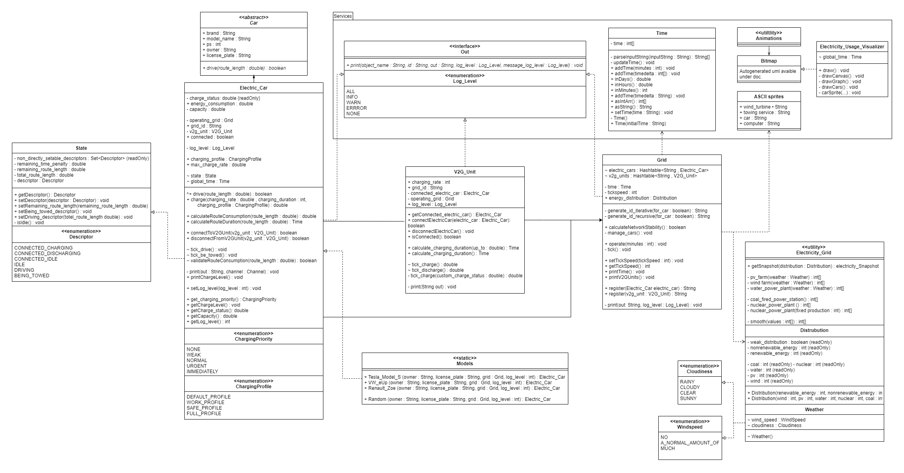

# Vehicle-To-Grid_Simulation
A (unfinished) simulation of a network that uses the vehicle to grid (V2G) technology.

The project was created during computer science classes, but was never finished due to the introduction of a time dimension and the growing effort involved.

# UML

